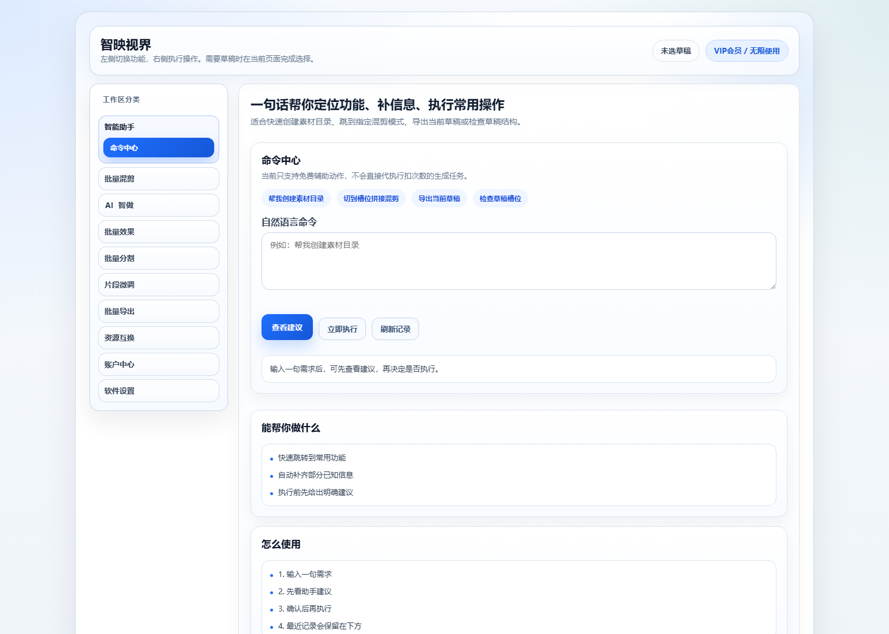
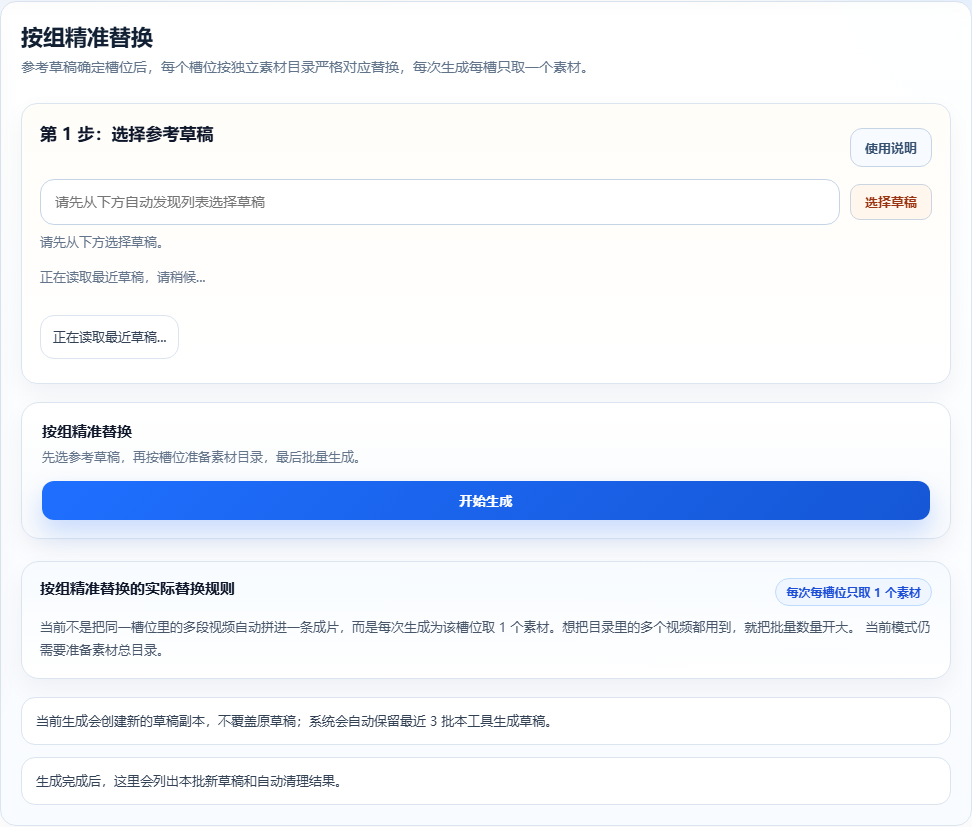
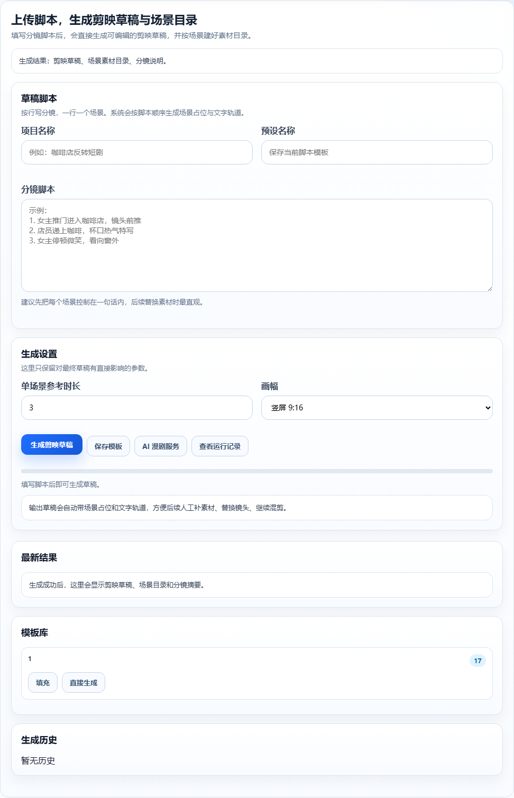
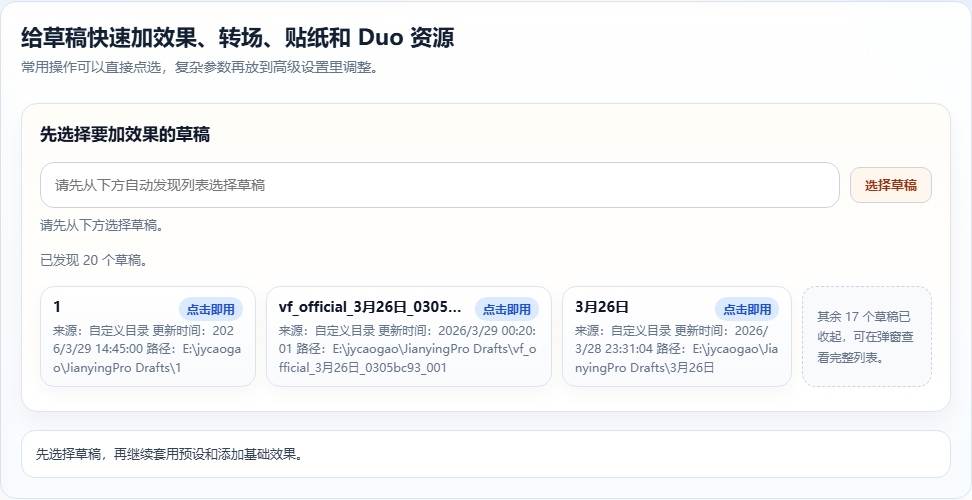
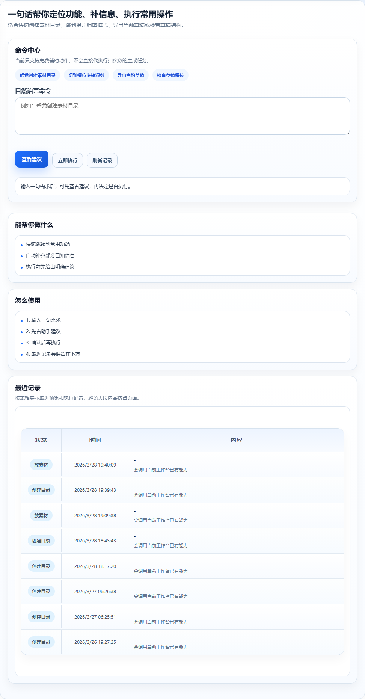

# JianYingvideo

[中文](README.md) | [English](README_EN.md)

剪映/CapCut 草稿自动化与桌面打包工具，支持新版剪映草稿结构，并接入 AI 生图模型。

JianYingvideo 是一套面向短视频矩阵生产、剪映草稿自动化、AI 漫剧/生图工作流和会员化运营的 Windows 桌面应用源码。它不是单一脚本，而是把本地草稿处理、用户工作台、Admin 后台、授权/CDK、配额体系、AI 账号管理和桌面打包链路放在同一个项目里，适合作为商业桌面软件、内部私有化工具或二次开发底座。

项目面向剪映/CapCut 9+ 草稿结构做适配，实际兼容性仍以本机剪映/CapCut 版本、草稿结构和素材路径为准。剪映版本迭代较快，二开或商用封包前建议用自己的真实草稿模板跑一轮回归。



## 快速导航

- [截图预览](#截图预览)
- [快速开始](#快速开始)
- [依赖与自检脚本](#依赖与自检脚本)
- [官网与下载页配置](#官网与下载页配置)
- [桌面端功能模块](#桌面端功能模块)
- [Admin 与商业化能力](#admin-与商业化能力)
- [桌面打包 / 安装包发布](#桌面打包--安装包发布)
- [服务端部署参考](#服务端部署参考)
- [项目结构](#项目结构)
- [联系与赞赏](#联系与赞赏)

## 截图预览

本仓库只引用已跟踪的展示图片，不引用 `user_data/`、`app/uploads/`、`.videofactory-runtime/` 或运行时缓存中的本机测试截图。

| 官网 / 运营首页 | 工作台 / 批量混剪 |
|---|---|
|  |  |

| AI 漫剧 / 生图 | 批量效果 / 助手 |
|---|---|
|  |  |



## 适合做什么

- **剪映草稿自动化工具**：读取、生成、替换和导出剪映/CapCut 草稿，减少重复手工剪辑。
- **短视频矩阵批量生产工作台**：围绕参考草稿、素材目录、文字槽位和导出队列做批量生产。
- **AI 漫剧/图文视频生产工具**：把 AI 文案、生图、分镜和草稿生成流程连接起来。
- **商业化 Windows 桌面软件**：内置登录、VIP、次数、CDK、设备绑定、Admin 后台和发布打包链路。
- **私有化二开底座**：保留 MCP/API 能力，方便继续接入外部模型、素材服务、自动化任务或自定义业务。

## 核心优势

- **草稿结构适配能力**：围绕剪映/CapCut 草稿结构做读写、替换、生成和导出，适合持续适配新版草稿结构。
- **从生成到运营闭环**：桌面端负责本地草稿处理，服务端/后台负责账号、授权、配额、公告、协议和商业化配置。
- **批量生产而非单点工具**：按组替换、素材池裂变、分区目录、批量效果、分割、微调和导出都围绕批量生产设计。
- **AI 能力可插拔**：AI 账号管理、生图、漫剧、文案和 TTS 入口已经预留，可按业务模型和账号体系扩展。
- **桌面打包可落地**：提供 Windows EXE/安装包打包脚本、Inno Setup 模板、发布检查和 manifest 追溯。
- **源码可二开，商业可封包**：项目源码已随仓库提供，便于学习、审阅和二次开发；真实环境配置、运行时工具和安装包产物独立管理。

## 项目源码包含什么 / 不包含什么

本仓库提供项目源码、文档、示例配置和打包脚本，方便学习、审阅和二次开发。

| 包含 | 不包含 |
|---|---|
| 应用源码、用户工作台、Admin、草稿服务、MCP/API、示例配置、迁移、打包脚本、安装包模板 | 真实 `.env`、真实 release preset、数据库、日志、缓存、用户上传内容、运行时工具、安装包、便携包 |

数据库文件不提交到 Git：不提交 `.db`、`.sqlite`、生产 MySQL dump 或任何用户数据。数据库结构由 `migrations/` 管理，二开者复制 `.env.example` 配置自己的数据库后，通过 `flask db upgrade` 初始化或升级表结构。

安装包、便携包和 `installer_manifest.json` 应通过 GitHub Releases 发布，不提交到 Git 历史。

## 快速开始

### Windows 一键初始化

下面命令适合二开者在 Windows 本机快速启动开发环境。脚本会创建 `venv`、安装 `requirements.txt`、复制 `.env.example`、执行数据库迁移并创建管理员账号。

```powershell
powershell -ExecutionPolicy Bypass -File scripts\bootstrap_dev.ps1 -AdminUsername admin -AdminEmail admin@example.com
```

管理员密码会在命令执行过程中交互输入，不写进脚本和文档。真实商业环境请改用自己的 MySQL、`.env` 和服务端配置。

### 手动初始化

如果你希望手动控制每一步，可以使用：

```powershell
python -m venv venv
venv\Scripts\pip.exe install -r requirements.txt
venv\Scripts\python.exe -m flask db upgrade
venv\Scripts\python.exe run.py
```

其中 `flask db upgrade` 会根据 `migrations/` 初始化或升级本地数据库结构。本仓库不提供真实默认管理员账号；二开或部署时应按自己的业务创建管理员和初始配置。

启动后优先验证 `/user` 工作台链路，再按需要测试批量混剪、分割、微调、导出、账户中心和 Admin 后台。

### 桌面一键打包参考

```powershell
venv\Scripts\python.exe scripts\prepackage_check.py
venv\Scripts\python.exe scripts\build_desktop_bundle.py --preset env.presets\desktop_full.env.example --name ZhiyingShijie
```

这条命令可以作为本项目的一键打包参考入口。正式发布时请使用本机私有 release preset 填入生产配置，并确保该 preset 不提交到 Git。

## 环境依赖

### 本机开发

- Windows 10/11。
- Python 虚拟环境，建议使用仓库已有 `venv` 或自行创建新环境。
- MySQL，商业化和多人使用建议使用 MySQL；SQLite 只适合临时本机调试。
- FFmpeg / FFprobe，用于素材分割、音视频处理和导出相关链路。
- 剪映 / CapCut 9+，并准备真实草稿目录和本地素材目录做兼容性回归。
- `.env` 本机配置，本仓库提供 `.env.example`，真实密钥、数据库地址和生产配置不要提交。

### 桌面打包

- PyInstaller 打包链路由 `packaging/video_factory_desktop.spec` 和 `scripts/build_desktop_bundle.py` 管理。
- Inno Setup 用于生成 Windows 安装包，模板在 `packaging/video_factory_installer.iss`。
- 真实 release preset、运行时工具、FFmpeg、官方草稿回归模板和私有服务配置由本机环境准备，不进入 Git。
- 打包前应先跑 `scripts/prepackage_check.py`，涉及剪映官方草稿能力时再按 `docs/windows_packaging.md` 增加草稿回归检查。

### 服务端部署

- Linux 服务器建议使用 Python 3.10+、MySQL、Nginx 和 Gunicorn。
- 服务端只负责登录注册、VIP、次数、CDK、设备绑定、邀请奖励、资源审核和 Admin 后台。
- 服务端依赖使用 `requirements.server.txt`，配置从 `env.presets/server_auth.env.example` 复制到 `.env` 后填入真实值。
- 详细说明见 `docs/server_auth_deploy.md`，生产环境不要把桌面端本地草稿处理链路放到服务器执行。

## 依赖与自检脚本

本仓库已经提供二开、部署和打包常用入口：

| 文件 / 脚本 | 用途 |
|---|---|
| `requirements.txt` | 本机开发和桌面端主依赖 |
| `requirements.server.txt` | 服务端 `remote-auth` 部署依赖 |
| `app/utils/JianYingApi/requirements.txt` | 内置第三方 JianYingApi 参考依赖 |
| `scripts/bootstrap_dev.ps1` | Windows 本机开发初始化 |
| `scripts/bootstrap_server.sh` | Linux 服务端安全初始化 |
| `scripts/create_admin.py` | 创建或修复管理员账号 |
| `scripts/runtime_selfcheck.py` | 运行时环境检查 |
| `scripts/selfcheck.py` | 基础接口 / 服务检查 |
| `scripts/prepackage_check.py` | 打包前检查 |
| `scripts/build_desktop_bundle.py` | 桌面 bundle / 安装包 staging 入口 |
| `scripts/server_backup.py` | 服务端备份辅助脚本 |

`bootstrap_server.sh` 只做安全初始化，不会自动重启 systemd 或修改 Nginx；README 提供可复制命令和仓库已有脚本入口，便于二开者按自己的服务器、数据库和打包环境调整。

## 官网与下载页配置

本项目自带官网首页和下载跳转入口：

- 官网首页：`/`
- 用户工作台：`/user`
- 下载跳转：`/download`
- 管理后台：`/admin`

管理员登录 `/admin` 后，可以在“站点管理”中配置站点名称、标题、关键词、描述、官网地址、下载地址、Logo 地址、用户协议、隐私协议、联系方式和公告。安装包不提交到 Git，建议上传到 GitHub Releases、对象存储、CDN 或自己的下载服务器，再把最终下载 URL 填入后台“下载地址”。详细说明见 `docs/website_setup.md`。

## 桌面端功能模块

### 批量混剪

批量混剪是本项目的主工作流，适合基于一个参考草稿批量生成多份可打开的剪映草稿。

- **按组精准替换**：按草稿中的素材槽位准备对应目录，适合模板结构固定、素材一一对应的批量生产。
- **全局裂变替换**：所有槽位共享一个素材池，可用顺序或随机策略生成更多组合。
- **分区裂变**：按片头、主体、片尾等结构化分区准备目录，适合固定结构模板。
- **文字槽处理**：支持读取草稿文字槽位并批量导入替换文本。
- **生成结果管理**：生成后列出新草稿和清理结果，避免旧草稿堆积影响识别。

### AI 成片

- 支持 AI 账号统一管理，模型服务可保存、启用、测试。
- 可接入图生视频、TTS、AI 文案等生产链路。
- 最近素材、模型账号和生成入口集中在工作台内，方便从素材准备进入成片生产。

### AI 漫剧 / 生图

- 支持 AI 漫剧、分镜、场景素材目录和草稿生成链路。
- 生图与素材整理结果可继续进入剪映草稿生成流程。
- 适合漫画解说、短剧分镜、图文视频和批量内容工厂做二次开发。

### 批量效果

- 支持动画、转场、视频效果、滤镜、贴纸、文本效果等能力。
- 保留 Duo 资源入口和效果检索入口。
- 适合在批量生成草稿后继续统一补效果、补转场或做风格化处理。

### 批量分割

- 支持文件分割、单视频/单路径基础分割能力。
- 支持多草稿队列、批量查看草稿结构、主视频片段识别。
- 适合在导出前检查草稿内容，也适合把长素材拆成可复用片段。

### 片段微调

- 支持变速、偏移、缩放、旋转、镜像翻转等片段级调整。
- 支持关键帧、摇晃和局部修饰类能力接入。
- 适合对批量生成后的草稿做最后一轮细节修正。

### 批量导出

- 支持多草稿导出队列。
- 支持导出目录检查和导出结果提示。
- 支持主视频片段导出，方便拆出草稿中的核心视频素材。

### 账户中心、设置与资源互换

- 账户中心展示会员状态、剩余次数、累计消耗、VIP 到期时间、签到、邀请和授权激活。
- 软件设置集中管理工作台偏好、草稿目录、素材目录、导出目录和 AI 账号。
- 资源互换支持项目名称、介绍、联系方式、会员等级、审核状态和发布记录展示。

## Admin 与商业化能力

项目内置一套适合商业化桌面软件的后台与授权基础。


- **用户与权限**：用户注册、登录、Token 校验、管理员权限、用户检索、导出、角色管理和用户删除。
- **次数、VIP 与积分体系**：剩余次数、累计生成量、VIP 到期时间、单用户/批量配额调整、签到奖励、邀请奖励和额度流水。
- **License / CDK / 设备绑定**：授权码激活、联网校验、反激活、设备指纹、设备数量限制、转移次数和离线 token 策略。
- **站点运营配置**：站点名称、Logo、下载地址、官方链接、用户协议、隐私协议、公告、联系渠道和卡类型展示。
- **API 商业化**：API Key 管理、权限模板、调用配额、调用审计、使用记录、效果日志和导出能力。
- **Remote Auth 模式**：桌面端本地 Admin 入口默认关闭，用户、授权、CDK、VIP、公告和运营配置应通过服务端后台统一管理。

## 封包档位与能力开关

项目采用“代码保留，通过运行时开关控制功能暴露”的策略。

| 档位 | 适用场景 | 主要能力 |
|---|---|---|
| Desktop Core | 本地剪映草稿处理工具 | 批量混剪、分割、微调、导出、账户、授权、本地 FFmpeg |
| Desktop Full | 商业完整版桌面包 | Desktop Core + AI、Duo、OpenClaw、AI 漫剧、商业化扩展能力 |

常见功能开关包括 `DUO_FEATURES_ENABLED`、`OPENCLAW_FEATURES_ENABLED`、`MANGA_FEATURES_ENABLED`、`LEGACY_TEMPLATE_ENDPOINTS_ENABLED`。商业版通常从 Desktop Full 出发，再按实际业务关闭少数功能；轻量版本可以从 Desktop Core 出发，只保留本地草稿处理主链路。

## 桌面打包 / 安装包发布

打包流程见 `docs/windows_packaging.md`。构建输出通常包括：

- 桌面 bundle：`build/release/<name>/`
- 安装脚本：`build/installer/<name>_setup.iss`
- 构建追溯：`installer_manifest.json`
- 可选安装包：由 Inno Setup 编译生成的 `.exe`

桌面打包前请先安装 `requirements.txt` 并运行 `scripts/prepackage_check.py`。正式发布时请使用本机私有 release preset 填入生产配置，并确保该 preset 不提交到 Git；本仓库只保留 `.example` 示例配置。

## Release 附件

桌面安装包建议通过 GitHub Releases 发布，例如：

- `ZhiyingShijie_<version>.exe`
- 可选便携包 `ZhiyingShijie_<version>_portable.zip`
- `installer_manifest.json`

每次发布应保证 Release 说明与 manifest 中的提交、分支、构建时间和 `git_dirty` 状态一致。

## 服务端部署参考

服务端部署用于 `remote-auth` 模式下的账号、授权、配额和后台运营，不负责在服务器上处理用户本地剪映草稿。

```bash
bash scripts/bootstrap_server.sh --admin admin --email admin@example.com
```

脚本会创建 `venv`、安装 `requirements.server.txt`、复制 `env.presets/server_auth.env.example`、检查 `.env` 必填项、执行迁移并创建管理员。它不会写入真实密钥、不会创建 MySQL 用户/数据库、不会修改 Nginx、不会重启 systemd。完整部署边界以 `docs/server_auth_deploy.md` 和 `docs/server_ops.md` 为准。

## 项目结构

```text
app/                         Web 后端、用户工作台、Admin、API、草稿服务
app/models/                  用户、任务、授权、CDK、配额、AI、资源互换等数据模型
app/views/                   用户端、Admin、鉴权、MCP/API 等 HTTP 路由
app/services/                AI、用户配额、剪映草稿、批量生成、OpenClaw 等业务服务
app/services/jianying/       剪映草稿替换、官方草稿兼容、权限、用量和校验逻辑
app/static/                  工作台、落地页、图片、CSS、JS 和 Swagger 静态资源
app/templates/               登录页、用户工作台、Admin、落地页和旧页面模板
app/utils/                   通用工具、加密、路径、FFmpeg、授权、运行时辅助
app/utils/JianYingApi/       第三方剪映 API 内置源码
app/utils/jianying_mcp/      本地 MCP 草稿操作能力
blanks/                      空白草稿模板
docs/                        打包、发布、设置、授权、回归和功能文档
env.presets/                 示例环境配置，只提交 .example
migrations/                  数据库迁移
packaging/                   PyInstaller / Inno Setup 打包配置和发布模板
scripts/                     自检、回归、打包、发布、诊断和辅助脚本
config.py                    Flask/桌面运行配置
desktop_app.py               Windows 桌面壳入口
run.py                       Web/本地调试入口
run_worker.py                兼容后台任务入口
runtime_paths_shared.py      桌面运行时路径封装
wsgi.py                      WSGI 入口
```

## 二开建议

- **改用户工作台**：优先看 `app/templates/user/index.html`、`app/static/js/user-index.js`、`app/static/css/user-index.css`、`app/views/api.py`。
- **改 Admin / 商业化能力**：优先看 `app/views/admin.py`、`app/templates/user/admin.html`，以及用户、授权、CDK、配额相关 models。
- **改剪映草稿能力**：优先看 `app/services/jianying/`、`app/utils/jianying_mcp/`、`app/utils/JianYingApi/`。
- **改 AI 能力**：优先看 `app/services/ai_service.py`、`app/services/openclaw_client.py`、`app/models/ai_provider.py`、`app/models/user_api_key.py`。
- **改打包发布**：优先看 `scripts/build_desktop_bundle.py`、`scripts/prepackage_check.py`、`packaging/`、`docs/windows_packaging.md`。
- **做商业封包**：先确定 Desktop Core / Desktop Full 档位，再通过运行时开关控制 AI、Duo、OpenClaw、AI 漫剧等能力是否暴露。

## 当前边界

- 分区裂变已有入口和目录提示，但具体业务模板仍需要按真实草稿结构调试。
- 文件分割和草稿结构查看已有基础能力，真实生产环境仍建议按素材类型做回归测试。
- AI、Duo、OpenClaw、AI 漫剧等能力受运行时开关、账号配置和外部服务可用性影响。
- 本项目不是剪映/CapCut 官方项目，相关商标归各自权利方所有；使用时需要自行确认剪映/CapCut 版本、草稿目录和素材路径。

## 联系与赞赏

如果这个项目对你有帮助，欢迎赞赏支持后续维护；商业合作、定制开发、部署打包、剪映草稿适配和二开问题，可以通过微信联系作者。

| 微信联系 | 赞赏支持 |
|---|---|
|  |  |

## 鸣谢

本项目在剪映草稿结构理解、自动化能力和工具链整理过程中，参考并复用了部分开源项目的思路与代码，在此特别感谢：

- [JianYing-Automation/JianYingApi](https://github.com/JianYing-Automation/JianYingApi)：第三方剪映 API 项目，当前仓库内置的 `app/utils/JianYingApi/` 源码来源于该项目，并保留其 MIT License。
- [GuanYixuan/pyJianYingDraft](https://github.com/GuanYixuan/pyJianYingDraft)：Python 剪映草稿生成与编辑工具，本项目的 MCP 草稿导出、效果枚举和部分草稿能力接入参考了该生态。

感谢以上项目作者和社区对剪映/CapCut 自动化方向的探索。

## License

本项目使用 MIT License。你可以使用、复制、修改、分发和商用本项目代码，但需要保留原始版权声明和许可证文本。
